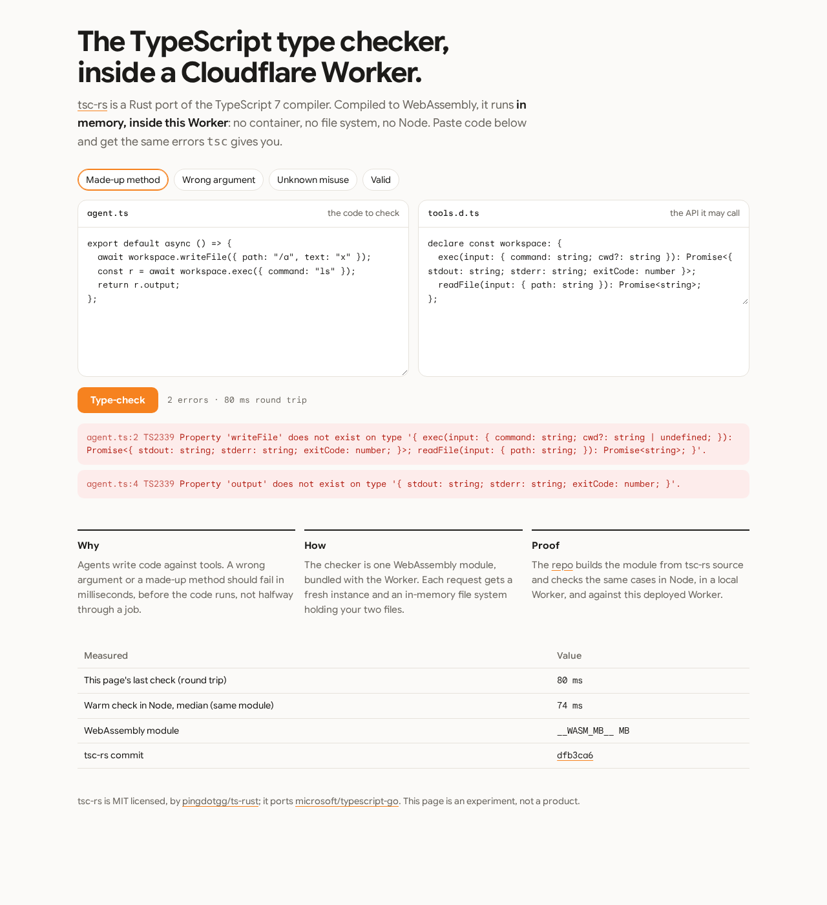

# tsc-rs in a Cloudflare Worker, or your browser

The TypeScript 7 type checker, running **inside a Cloudflare Worker**, in memory, or **in your browser** with the
same module. No container, no file system, no Node.

**Try it: https://tsc-rs.coey.dev**

[](https://tsc-rs.coey.dev)

[tsc-rs](https://github.com/pingdotgg/ts-rust) is a Rust port of the TypeScript 7 compiler
([microsoft/typescript-go](https://github.com/microsoft/typescript-go)). It already ships a
WebAssembly build. This repo bundles that build into a Worker, puts an HTTP endpoint and a demo page
in front of it, and checks that it gives the same errors `tsc` does: in Node, in a local Worker, and
against the deployed site.

The demo page can also run **the same module in your browser**: switch to *Your browser*, and it downloads the
checker once (2.0 MB), runs it in a background thread, and keeps it for offline use.

```
POST https://tsc-rs.coey.dev/check
{ "files": { "agent.ts": "...", "tools.d.ts": "..." } }

→ { "ok": false, "exitCode": 2, "diagnostics": [
    { "code": 2339, "line": 2, "file": "/p/agent.ts",
      "text": "Property 'writeFile' does not exist on type '{ exec(...); readFile(...); }'." } ] }
```

## Why

Agents write code against tool APIs. If an agent calls a method that doesn't exist, or passes a string
where an object belongs, that should be caught **in milliseconds, before the code runs**. Give the checker
a `tools.d.ts` generated from your tool schemas, plus the agent's code, and it returns real `tsc` errors.

## Results

Measured on 2026-10-07 with tsc-rs commit `dfb3ca6`. Raw numbers are in [`results/`](results/).

| Case | Expected | Node | Local Worker | Deployed Worker |
|---|---|---|---|---|
| `state.nonExistentMethod.panic()` on `Record<string, unknown>` | TS18046 | ✅ | ✅ | ✅ |
| Valid plain code | no errors | ✅ | ✅ | ✅ |
| Tool call with a string instead of `{ command }` | TS2345 | ✅ | ✅ | ✅ |
| Made-up method `writeFile` and field `output` | TS2339 ×2 | ✅ | ✅ | ✅ |
| Valid tool call | no errors | ✅ | ✅ | ✅ |

There are two builds of the module. The deployed site uses the small one.

| | Small build (deployed) | Fast build |
|---|---|---|
| Optimised for | size (`scripts/build-wasm.sh small`) | build speed (`scripts/build-wasm.sh`) |
| Module size | **4.7 MB (2.0 MB gzip)** | 14.5 MB (4.0 MB gzip) |
| Build time (4 cores, warm cargo cache) | about 5 min | about 3 min |
| Warm check, Node 22 (median) | 74 ms | 55 ms |
| Warm check, local Worker | 48–67 ms | 69–77 ms |
| First check, Node 22 | 190 ms | about 157 ms |
| Peak memory, whole Node process | 98 MB | 120 MB |

On the deployed Worker, a check takes **70–150 ms round trip** from a client in a cloud sandbox, including the
network. All 10 requests in the deployed test succeeded inside the Workers 128 MB memory limit.

Deployed Workers only advance `performance.now()` across I/O, so on a deployed Worker the `ms` field in a response
reads 0; time requests from the client instead.

### In your browser

The same module, run by the demo page in Chromium 153 against the deployed site
([`results/browser-deployed.json`](results/browser-deployed.json)). *Worker* times are round trips from a client in
a cloud sandbox; *browser* times are the check alone, on that machine.

| Preset | Expected | Worker | Your browser | Your browser, offline |
|---|---|---|---|---|
| Made-up method | TS2339 ×2 | ✅ 89 ms | ✅ 82 ms | |
| Wrong argument | TS2345 | ✅ 87 ms | ✅ 65 ms | ✅ 70 ms |
| Unknown misuse | TS18046 | ✅ 95 ms | ✅ 58 ms | |
| Valid | no errors | ✅ 82 ms | ✅ 57 ms | ✅ 59 ms |

The first browser check also loads the checker: a 2.0 MB download (Brotli; 4.7 MB unpacked), compiled once, which
took 127–342 ms across runs from that sandbox. After that, the service worker keeps it, and checks work offline.
Browser speed depends on the machine, and the module needs a modern browser with a decent amount of memory (a check
peaked near 100 MB in Node).

## Run it

Needs Rust (with `rustup target add wasm32-wasip1`), a C compiler, and Node 22.

```sh
npm install
scripts/build-wasm.sh          # clones tsc-rs at dfb3ca6 and builds the fast module
scripts/build-wasm.sh small    # or the small one (slow; needs binaryen 132 or later for wasm-opt)
node test/bench.mjs            # Node: all cases, writes results/node.json
node test/worker-test.mjs      # starts wrangler dev, all cases, writes results/worker-local.json
npm run dev                    # demo page at http://localhost:8787

# with npm run dev running, in another terminal:
npx playwright install chromium
node test/browser-test.mjs     # the page in Chromium: every preset on the Worker, in the browser, and offline
```

### Deploy to your own account

```sh
npx wrangler login
npm run deploy
node test/worker-test.mjs https://<your-worker-url>   # same cases against your deployed Worker
```

To serve it on your own domain, add a `routes` entry to `worker/wrangler.jsonc` (there's a commented example), or
run `npx wrangler deploy --domain tsc-rs.example.com` from `worker/`.

Optional: `npx wrangler secret put TOKEN` makes `/check` require `Authorization: Bearer <TOKEN>`.
`wrangler.jsonc` sets a 30-checks-per-minute-per-IP rate limit; remove that block if your account has no
rate limiting.

### Continuous checks

[`ci/proof.yml`](ci/proof.yml) is a GitHub Actions workflow that builds the module from source and runs the Node and
local Worker checks. Copy it to `.github/workflows/` to turn it on.

## Files

| Path | What it is |
|---|---|
| `worker/src/index.js` | The Worker: demo page, `POST /check`, size cap, rate limit, optional token |
| `worker/src/page.html` | The demo page |
| `worker/src/core.js` | The tsc-rs JavaScript host, copied unchanged ([NOTICE](NOTICE.md)) |
| `worker/public/` | Static files for *Your browser*: the same `ts_rust.wasm`, the tsc-rs `browser.js` and `core.js` (unchanged), and `check-worker.js`, which runs checks off the page's main thread |
| `worker/src/sw.js.txt` | Service worker: keeps the page, and the in-browser checker once used, available offline |
| `scripts/build-wasm.sh` | Builds `worker/src/ts_rust.wasm` from tsc-rs source |
| `test/cases.mjs` | The cases and the error codes they must produce |
| `test/bench.mjs`, `test/worker-test.mjs` | Node and Worker checks |
| `test/browser-test.mjs` | Opens the page in Chromium: every preset on the Worker and in the browser, then offline |
| `results/` | The measured runs: `node.json`, `worker-local.json`, `worker-deployed.json` |
| `ci/proof.yml` | GitHub Actions workflow: build from source, run both checks |

## Caveats

tsc-rs was released on 2026-10-07. Its README says it was written by models and that its author hasn't read the
code. Treat this as an experiment. Each check runs one at a time on a fresh WebAssembly instance.

tsc-rs is MIT licensed; see [NOTICE.md](NOTICE.md).
